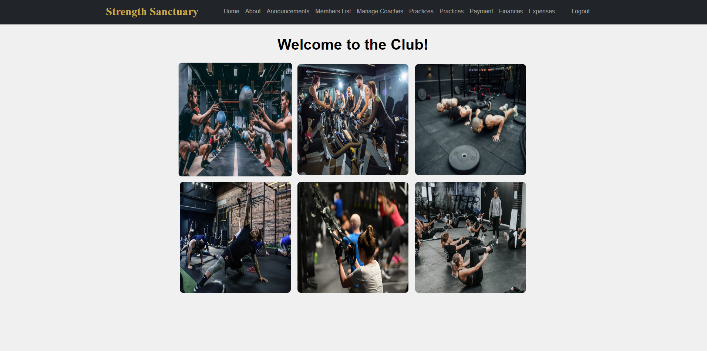

# Recreational-Club-Membership

Welcome to our club! We are a spirited community of dance enthusiasts who meet weekly to enjoy salsa and other dance styles under the guidance of our passionate amateur coach. Flexible attendance and payment options make it easy for members to join whenever they can, ensuring everyone can partake in the fun. We value commitment and provide gentle reminders for payments and upcoming sessions, maintaining a friendly and responsible environment. Join us to dance, learn, and create lasting friendships!



## Run Locally

Clone the project

```bash
  git clone https://github.com/Raymond3lam/Recreational-Club-Membership.git
```

Go to the project directory

```bash
  cd Recreational-Club-Membership 
```

Create virtual environment

```bash
  pip install virtualenv
  python<version> -m venv .venv
```

Activate virtual environment

MacOS/Linux:
```bash
  source .env/bin/activate
```
Windows:
```bash
  env/Scripts/activate.bat
```

Install dependencies

```bash
  pip install -r requirements.txt
```

Apply Database Migrations

```bash
  python manage.py makemigrations
  python manage.py migrate
```

Start the server

```bash
  python manage.py runserver
```

View application at

```bash
  http://127.0.0.1:8000/
```

## Contributing

Parsa, Chris, Raymond, Luxman, Irfan

## Tech Stack

- Django (python)
- Database: SQL

